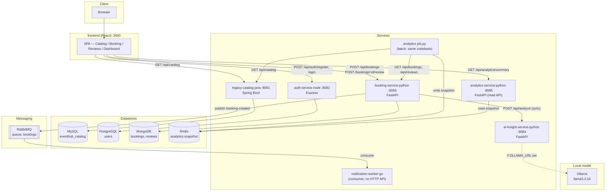

# EventHub — System Architecture

```mermaid
flowchart TB
    subgraph Client
        Browser["Browser"]
    end

    subgraph Frontend["frontend (React) :3000"]
        FE["SPA — Catalog / Booking / Reviews / Dashboard"]
    end

    subgraph Services["Services"]
        CAT["legacy-catalog-java :8081\nSpring Boot"]
        AUTH["auth-service-node :8082\nExpress"]
        BOOK["booking-service-python :8083\nFastAPI"]
        AI["ai-insight-service-python :8084\nFastAPI"]
        ANLY["analytics-service-python :8085\nFastAPI (read API)"]
        JOB["analytics job.py\n(batch, same codebase)"]
        WORKER["notification-worker-go\n(consumer, no HTTP API)"]
    end

    subgraph Data["Datastores"]
        MYSQL[("MySQL\neventhub_catalog")]
        PG[("PostgreSQL\nusers")]
        MONGO[("MongoDB\nbookings, reviews")]
        REDIS[("Redis\nanalytics:snapshot")]
    end

    subgraph Broker["Messaging"]
        MQ[["RabbitMQ\nqueue: bookings"]]
    end

    subgraph AIStack["Local model"]
        OLLAMA["Ollama\nllama3.2:1b"]
    end

    Browser --> FE
    FE -- "GET /api/catalog" --> CAT
    FE -- "POST /api/auth/register, login" --> AUTH
    FE -- "POST /api/bookings\nPOST /bookings/:id/review" --> BOOK
    FE -- "GET /api/analytics/summary" --> ANLY

    CAT --> MYSQL
    AUTH --> PG
    BOOK --> MONGO

    BOOK -- "publish booking-created" --> MQ
    MQ -- "consume" --> WORKER

    BOOK -- "POST /api/analyze (sync)" --> AI
    AI -. "if OLLAMA_URL set" .-> OLLAMA

    JOB -- "GET /api/catalog" --> CAT
    JOB -- "GET /api/bookings, /api/reviews" --> BOOK
    JOB -- "write snapshot" --> REDIS
    ANLY -- "read snapshot" --> REDIS
```
